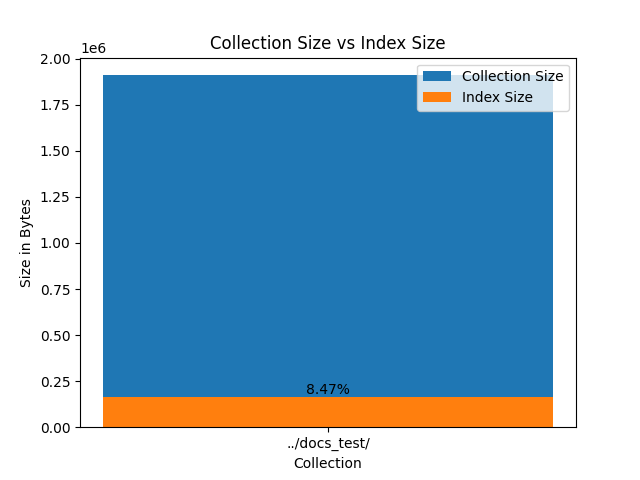
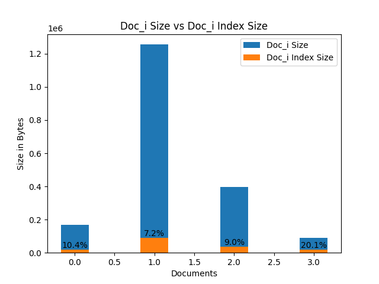
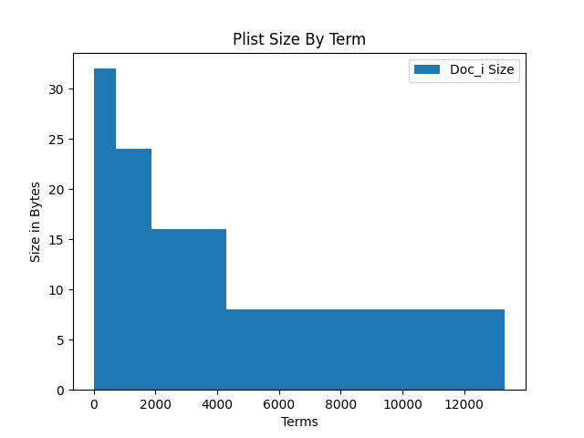

#### Ejecución

```
./main.py -s ../stopword-list.txt -d ../docs_test/ -t porter 
```

#### Conclusiones

Las pruebas fueron realizadas utilizando 4 libros del projecto Gutenberg. 

#### Overhead

El tamaño del indice obtenido representa el 8% del tamaño de la colección. A partir de ello podemos observar lo incompleta que termina siendo el indice y lo eficiente que resulta guardar un indice en una estructura de datos de estas caracteristicas. Es decir almacenar termino: [(doc_id_n, freq), ..., (doc_id_n+1, freq)] en lugar de un matriz de todos los doc_id por todos los terminos.



Luego observamos cuanto overhead es generado a nivel de archivo y observamos que varia en el orden del 10%, salvo para el último caso que llega al 20%.



#### Distribución *Postling Lists*

Observamos que la distribución de tamaño de las *posting list* se comporta siguiendo la Ley de Zipf, donde vemos que más de 50% de los terminos solo ocurren una vez, por lo tanto podemos decir que 50% de las *posting list* tiene un tamaño de 8 bytes.

