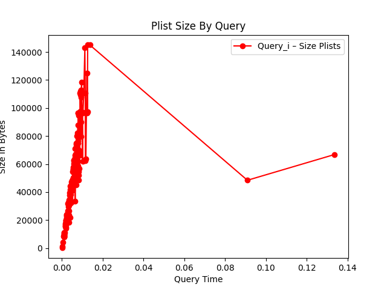
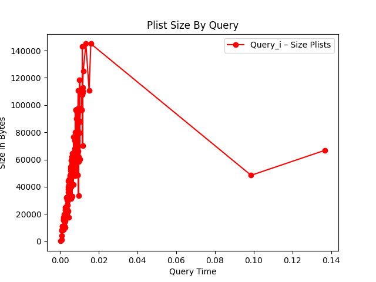

### Pruebas

#### Generación del Indice

Por motivos de demora de la generación del indice, primero creamos el indice para realizar la pruebas. 

```
./main.py -s ../stopword-list.txt -d ../en/ -t porter
```

> **Observación**: El script almacena la colección generada en un directorio temporal creado para esa colección, con el objetivo de que podamos luego volver a utilizar el indice generado. El nombre del directorio temporal es obtenido a partir de una operación sobre el path del nombre de la colección.

#### Queries

Ejecutamos las queries, primero agregando el parametro `-i` para cargar el indice el memoria.

```
./main.py -s ../stopword-list.txt -d ../en/ -t porter -q ../queries_2y3t.txt -i 
```
```
 [+] Index loaded.
 [*] Query - Average Time:  0.008707104126612346
```

Ahora ejecutamos las queries utilizando el indice el disco.

```
./main.py -s ../stopword-list.txt -d ../en/ -t porter -q ../queries_2y3t.txt 
```
```
 [+] Index loaded.
 [*] Query - Average Time:  0.009318426251411438
```

Podemos ver que el tiempo el promedio fue 0.001 segundos mejor. A partir de ello podemos inferir que no es necesario cargar el indice en memoria.

#### Tamaño de las Plist

Ahora analizamos el tamaño de las plist como factor de demora en la ejecución de las consultas. Podemos ver claramente que hay una relación entre las dos variables.

#### Utilizando el indice en memoria



#### Utilizando el indice en disco



> Aclaración: cada punto rojo lo contamos como la sumatoria de las *plists* de los terminos de la consulta sobre la colección.

Podemos ver otra vez, que los tiempos se mantuvieron muy similares utilizando el indice de las dos maneras. Por lo que refuerza la hipotesis de que cargar el indice en memoria no mejora los tiempos de ejecución de las queries.

Por otra parte hay dos conjuntos de listas que en ambas corridas no se comportaron como el resto (intuyo que el merging time pudo haber perjudicado dichos tiempos) pero los despreciamos ya que son solo 2 querys sobre un total de 120.